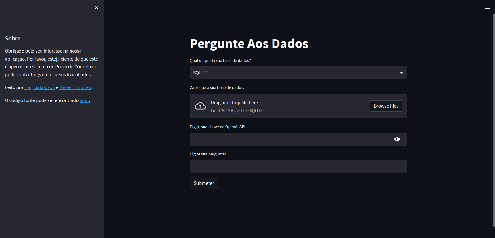

# Pergunte Aos Dados
## Visão Geral
Neste projeto é implementada uma aplicação (Web App) que utiliza *Large* *Language* *Models* (LLMs) para permitir que usuários, mesmo sem conhecimentos de SQL, sejam capazes de fazer consultas a bases de dados tabulares utilizando linguagem natural. Com a utilização dos LLMs, que são modelos poderosos e capazes de compreender e gerar texto em linguagem humana, os usuários podem formular suas perguntas de negócios de forma natural, eliminando a necessidade de aprender uma linguagem de consulta específica. Isso abre portas para uma maior acessibilidade e democratização do acesso aos dados, permitindo que profissionais de diferentes áreas possam explorar e obter insights valiosos a partir das bases de dados tabulares, impulsionando assim a tomada de decisões informadas e estratégicas.

## Como executar os códigos? 👨‍💻
Crie um ambiente virtual Python versão 3.10:
```bash
virtualenv -p python3.10 env
```
Ative o ambiente virtual: 
```bash
source /path/to/new/virtual/environment/bin/activate
```
Instale as dependências com ``requeriments.txt``:
```bash
pip install requirements.txt
```
Execute a aplicação (localmente):
```bash
streamlit run app.py
```
Saída esperada:
<center></center>

## A versão online do app pode ser encontrada [aqui](https://mikaelpbthemoteo-text2sql-app-8rhnk7.streamlit.app/). ☁️

✅## Um vídeo de apresentação e demonstração pode ser acessado [aqui]([https://mikaelpbthemoteo-text2sql-app-8rhnk7.streamlit.app/](https://youtu.be/2N2VrJICAmg).🎞️
[
